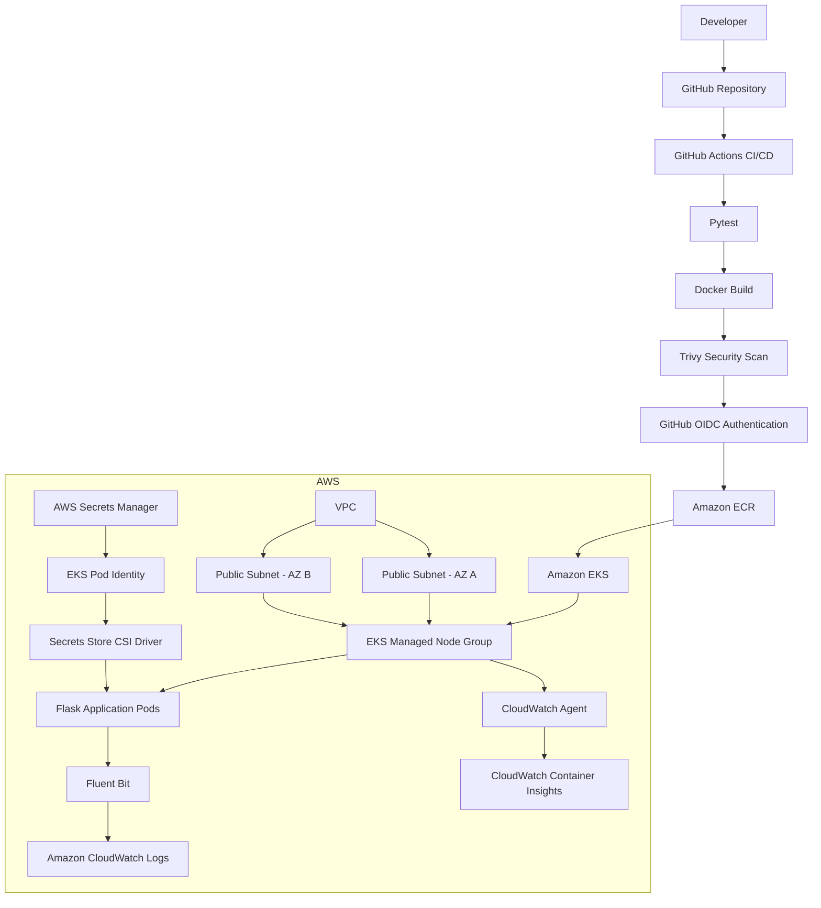

# Automated CI/CD Deployment of a Containerized Application on AWS

A hands-on DevOps project demonstrating how to build, secure, deploy, and monitor a containerized Python application on AWS using Terraform, Docker, GitHub Actions, Amazon ECR, Amazon EKS, AWS Secrets Manager, EKS Pod Identity, and Amazon CloudWatch.

The project implements an automated CI/CD pipeline where code changes are tested, containerized, security scanned, pushed to Amazon ECR, and deployed to Amazon EKS using immutable Git commit SHA image tags.

---

## Project Objectives

This project was built to demonstrate practical Cloud and DevOps engineering skills including:

- Infrastructure as Code with Terraform
- Containerization with Docker
- Kubernetes workload deployment
- Automated CI/CD with GitHub Actions
- Secure AWS authentication using GitHub OIDC
- Container image vulnerability scanning with Trivy
- Secure secret delivery using AWS Secrets Manager
- EKS Pod Identity and least-privilege IAM
- Centralized Kubernetes application logging
- EKS monitoring with Amazon CloudWatch Container Insights
- Kubernetes health checks and resource management
- Troubleshooting real EKS scheduling and capacity issues

---

## Architecture



---

## Technology Stack

| Area | Technologies |
|---|---|
| Cloud | AWS |
| Infrastructure as Code | Terraform |
| Containers | Docker |
| Container Registry | Amazon ECR |
| Orchestration | Kubernetes / Amazon EKS |
| CI/CD | GitHub Actions |
| AWS Authentication | GitHub OIDC |
| Security Scanning | Trivy |
| Secrets Management | AWS Secrets Manager |
| Kubernetes Secret Integration | Secrets Store CSI Driver |
| AWS Workload Identity | EKS Pod Identity |
| Monitoring | Amazon CloudWatch Container Insights |
| Logging | Fluent Bit / CloudWatch Logs |
| Application | Python / Flask |
| Testing | Pytest |
| CLI / Scripting | Bash, AWS CLI, kubectl |

---

## Repository Structure

```text
.
├── .github/
│   └── workflows/
│       └── ci.yml
│
├── app/
│   ├── tests/
│   ├── __init__.py
│   ├── app.py
│   └── requirements.txt
│
├── k8s/
│   ├── namespace.yaml
│   ├── configmap.yaml
│   ├── deployment.yaml
│   ├── deployment-eks.yaml
│   ├── service.yaml
│   ├── serviceaccount.yaml
│   └── secretproviderclass.yaml
│
├── terraform/
│   ├── versions.tf
│   ├── provider.tf
│   ├── network.tf
│   ├── iam.tf
│   ├── eks.tf
│   ├── eks-access.tf
│   ├── addons.tf
│   ├── secrets.tf
│   ├── monitoring.tf
│   └── outputs.tf
│
├── Dockerfile
├── .dockerignore
├── .gitignore
└── README.md
```

Terraform state files, Terraform plan files, local virtual environments, and other generated files are intentionally excluded from Git.

---

## Application

The project uses a simple Python Flask application.

It exposes three HTTP endpoints:

| Endpoint | Purpose |
|---|---|
| `/` | Application home page |
| `/health` | Kubernetes health endpoint |
| `/version` | Application version information |

### Home Endpoint

```text
RENUJA DevOps Project
```

### Health Endpoint

```json
{
  "status": "healthy"
}
```

### Version Endpoint

```json
{
  "application": "RENUJA DevOps Project",
  "version": "1.0.0"
}
```

---

## Docker Implementation

The Flask application is packaged into a Docker container.

The Docker build process:

1. Uses `python:3.12-slim`
2. Updates operating system packages
3. Sets the application working directory
4. Installs Python dependencies
5. Copies the application source code
6. Starts the Flask application on port `5000`

The image is built automatically by GitHub Actions.

Before deployment, the image is scanned using Trivy.

---

## CI/CD Pipeline

The project uses GitHub Actions for continuous integration and continuous deployment.

### Pull Request Pipeline

For pull requests targeting `main`, the workflow performs:

```text
Pull Request
     |
     v
Checkout Source
     |
     v
Set Up Python
     |
     v
Install Dependencies
     |
     v
Run Pytest
     |
     v
Build Docker Image
     |
     v
Run Trivy Security Scan
     |
     v
Required CI Check
```

A pull request must pass the required `test` check before it can be merged.

---

## Main Branch Deployment Pipeline

When a pull request is merged into `main`, GitHub Actions automatically performs the deployment workflow:

```text
Push to main
      |
      v
Run Tests
      |
      v
Build Docker Image
      |
      v
Run Trivy Scan
      |
      v
Authenticate to AWS using OIDC
      |
      v
Login to Amazon ECR
      |
      v
Tag Image with Git Commit SHA
      |
      v
Push Image to ECR
      |
      v
Configure kubectl for EKS
      |
      v
Apply Kubernetes Resources
      |
      v
Inject Current Git SHA into Deployment
      |
      v
Deploy Application to EKS
      |
      v
Verify Kubernetes Rollout
```

---

## Immutable Container Deployments

The pipeline does not rely on mutable tags such as `latest`.

Each deployment uses the full Git commit SHA as the Docker image tag.

Example Git commit:

```text
c3897210bc7d2b27b046684fbcdcc1ee2f1df125
```

Example container image:

```text
<ACCOUNT_ID>.dkr.ecr.us-east-1.amazonaws.com/renuja-devops-app:c3897210bc7d2b27b046684fbcdcc1ee2f1df125
```

This creates direct traceability between:

```text
Git Commit
    |
    v
Docker Image
    |
    v
Amazon ECR
    |
    v
Amazon EKS Deployment
```

The final deployment was verified by comparing the Git `main` commit SHA with the image tag running inside EKS.

Both values matched exactly.

---

## GitHub OIDC Authentication

The CI/CD pipeline does not store long-lived AWS access keys inside GitHub.

GitHub Actions authenticates to AWS using OpenID Connect.

```text
GitHub Actions
      |
      v
GitHub OIDC Token
      |
      v
AWS IAM Role
      |
      v
Temporary AWS Credentials
```

This provides temporary AWS credentials only when the workflow runs.

The GitHub Actions IAM role is limited to the permissions required for the deployment pipeline.

These include:

- Authentication to Amazon ECR
- Push access to the required ECR repository
- `eks:DescribeCluster`
- Namespace-scoped Kubernetes permissions through an EKS Access Entry

---

## Terraform Infrastructure

Terraform is used to provision and manage the AWS infrastructure required by the application.

Major Terraform components include:

```text
VPC
Public Subnets
Internet Gateway
Route Table
EKS Cluster
EKS Managed Node Group
IAM Roles
EKS Access Entry
EKS Pod Identity Agent
Secrets Store CSI Driver
AWS Secrets Manager
Pod Identity Association
CloudWatch Observability Add-on
```

Terraform configuration is divided into multiple files based on responsibility.

---

## AWS Networking

The project creates:

- One VPC
- Two public subnets
- Two Availability Zones
- One Internet Gateway
- One public route table
- Route table associations

The network was intentionally designed without a NAT Gateway to reduce lab costs.

Worker nodes are deployed inside public subnets for this learning environment.

This is a cost-conscious lab architecture rather than a production network design.

---

## Amazon EKS

Terraform provisions an Amazon EKS cluster and a managed EC2 node group.

The node group uses:

```text
Instance Type: t3.small
Capacity Type: ON_DEMAND
Disk Size: 20 GB
Worker Nodes: 3
```

The final node group uses three worker nodes because the Kubernetes system services, observability components, CSI components, and application workloads exceeded the pod scheduling capacity of the original smaller configuration.

---

## Kubernetes Deployment

The EKS application deployment includes:

- Dedicated Kubernetes namespace
- Two application replicas
- ClusterIP Service
- ConfigMap-based configuration
- Dedicated ServiceAccount
- Readiness probe
- Liveness probe
- CPU requests
- Memory requests
- CPU limits
- Memory limits
- AWS Secrets Manager CSI volume
- Immutable ECR image deployment

---

## Health Probes

The Flask `/health` endpoint is used by Kubernetes for both readiness and liveness checks.

```text
Readiness Probe
      |
      v
/health

Liveness Probe
      |
      v
/health
```

The readiness probe determines whether a Pod is ready to receive traffic.

The liveness probe determines whether the running container remains healthy.

If a container becomes unhealthy, Kubernetes can restart it automatically.

---

## Kubernetes Resource Management

The application specifies CPU and memory requests and limits.

This allows Kubernetes to make better scheduling decisions and prevents the application from using unlimited worker-node resources.

Example concepts used:

```text
Requests
    |
    +--> Minimum CPU required
    |
    +--> Minimum memory required

Limits
    |
    +--> Maximum CPU usage
    |
    +--> Maximum memory usage
```

---

## AWS Secrets Manager Integration

The project stores an application secret inside AWS Secrets Manager.

The secret value is not committed to Git.

The secret value is also not stored directly inside Terraform configuration.

The integration works through:

```text
AWS Secrets Manager
        |
        v
Application IAM Role
        |
        v
EKS Pod Identity
        |
        v
Kubernetes ServiceAccount
        |
        v
Secrets Store CSI Driver
        |
        v
SecretProviderClass
        |
        v
Mounted Secret File
        |
        v
Application Pod
```

The application Pod uses a dedicated Kubernetes ServiceAccount.

That ServiceAccount is associated with a dedicated AWS IAM role through EKS Pod Identity.

The IAM role has permission only to retrieve the required secret.

---

## Secret Verification

The Secrets Manager integration was verified without printing the actual secret value.

The mounted file was checked inside the application Pod:

```bash
test -s /mnt/secrets-store/APP_SECRET
```

The verification confirmed that the secret was successfully mounted into the workload.

The actual secret value was never exposed during the verification.

> Note: The current sample Flask application does not consume the secret as part of its business logic. This project demonstrates secure secret retrieval and mounting into the Kubernetes workload.

---

## Least-Privilege IAM Design

Different workloads use separate IAM roles.

```text
EKS Control Plane
      |
      v
EKS Cluster IAM Role


EKS Worker Nodes
      |
      v
EKS Node IAM Role


Application Pod
      |
      v
Application Pod Identity IAM Role


CloudWatch Agent
      |
      v
CloudWatch Observability IAM Role


GitHub Actions
      |
      v
GitHub OIDC IAM Role
```

This avoids giving one IAM identity unnecessary access to every part of the system.

---

## EKS Access for GitHub Actions

GitHub Actions requires access to deploy Kubernetes resources into EKS.

The project uses:

- An EKS Access Entry
- `AmazonEKSEditPolicy`
- Namespace-scoped permissions

The GitHub Actions role is limited to the:

```text
renuja-devops
```

namespace.

Cluster-wide Kubernetes administrative permissions are not given to the GitHub Actions workflow.

---

## SecretProviderClass Security Boundary

The Secrets Store CSI Driver uses a Kubernetes custom resource called:

```text
SecretProviderClass
```

The namespace-scoped GitHub Actions permissions do not provide access to manage this custom API resource.

Therefore, the `SecretProviderClass` is treated as part of the security/infrastructure bootstrap rather than the normal application CD workflow.

This avoids unnecessarily expanding the GitHub Actions IAM and Kubernetes permissions.

---

## Amazon CloudWatch Monitoring

Amazon CloudWatch Observability is deployed as an EKS managed add-on.

The implementation includes:

- OpenTelemetry-based Container Insights
- CloudWatch Agent
- Fluent Bit
- kube-state-metrics
- node-exporter
- EKS Pod Identity
- Dedicated CloudWatch IAM role

The EKS add-on version used during the project was:

```text
v6.6.0-eksbuild.1
```

---

## CloudWatch Pod Identity

The CloudWatch Agent uses EKS Pod Identity.

The service account used by the add-on is:

```text
cloudwatch-agent
```

It assumes a dedicated IAM role that has the AWS managed policy:

```text
CloudWatchAgentServerPolicy
```

This allows the observability workload to publish monitoring information without adding CloudWatch permissions directly to the worker-node role.

---

## Application Signals

CloudWatch Application Signals automatic monitoring was disabled.

The project focuses on:

```text
Infrastructure Metrics
Kubernetes Metrics
Container Metrics
Centralized Application Logs
```

rather than full application tracing or APM.

This also reduces unnecessary telemetry and cost for the learning environment.

---

## Container Insights Metrics

CloudWatch Container Insights successfully collected Kubernetes and container metrics.

Examples include:

```text
cluster_node_count
cluster_number_of_running_pods
namespace_number_of_running_pods
container_cpu_limit
container_cpu_request
container_cpu_utilization
container_memory_limit
container_memory_request
container_memory_utilization
node_cpu_limit
node_cpu_reserved_capacity
node_cpu_usage_total
```

The `cluster_node_count` metric was queried directly through AWS CLI.

The final monitoring configuration reported:

```text
cluster_node_count = 3
```

after the worker-node capacity was increased.

---

## Centralized Application Logging

Fluent Bit collects Kubernetes container logs from the EKS worker nodes and forwards them to Amazon CloudWatch Logs.

The project created the following Container Insights log groups:

```text
/aws/containerinsights/renuja-devops-eks/application
/aws/containerinsights/renuja-devops-eks/dataplane
/aws/containerinsights/renuja-devops-eks/host
/aws/containerinsights/renuja-devops-eks/performance
```

---

## Application Log Verification

Traffic was generated against the Flask application using:

```bash
curl http://127.0.0.1:8080/
curl http://127.0.0.1:8080/health
curl http://127.0.0.1:8080/version
```

Health requests were also generated repeatedly.

Application logs were first verified using:

```bash
kubectl logs
```

and then verified directly inside CloudWatch Logs.

Example application log:

```text
GET /health HTTP/1.1 200
```

---

## Kubernetes Metadata in CloudWatch

CloudWatch application log events contained Kubernetes metadata such as:

```text
pod_name
namespace_name
pod_id
host
pod_ip
container_name
container_image
container_hash
```

This makes it possible to trace a log event back to the exact:

```text
Kubernetes Pod
Worker Node
Container
Container Image
Image Digest
Git-based Image Tag
```

that produced the event.

---

## Kubernetes Capacity Troubleshooting

One of the most important troubleshooting scenarios in this project occurred while deploying CloudWatch Observability.

The CloudWatch add-on initially entered:

```text
DEGRADED
```

state.

AWS reported:

```text
InsufficientNumberOfReplicas
```

with the scheduling error:

```text
Too many pods
```

---

## Root Cause

The original `t3.small` worker node supported a maximum of:

```text
11 pods
```

The worker node was already running:

```text
11 / 11 pods
```

when the CloudWatch observability components attempted to start.

As a result, components such as:

```text
amazon-cloudwatch-observability-controller-manager
kube-state-metrics
```

could not be scheduled.

---

## Troubleshooting Commands

The problem was investigated using commands such as:

```bash
kubectl get nodes \
  -o custom-columns=NAME:.metadata.name,MAX_PODS:.status.capacity.pods
```

```bash
kubectl get pods -A \
  --field-selector=status.phase=Pending
```

```bash
kubectl get events -n amazon-cloudwatch \
  --sort-by=.lastTimestamp
```

```bash
kubectl get pods -A \
  --field-selector spec.nodeName=<NODE_NAME>
```

These checks confirmed that pod density, rather than application failure, was the root cause.

---

## Capacity Solution

The EKS managed node group was scaled using Terraform.

The configuration was eventually increased to:

```text
desired_size = 3
min_size     = 1
max_size     = 3
```

After scaling:

```text
Worker Nodes             → 3 Ready
CloudWatch Add-on        → ACTIVE
Pending Pods             → 0
Application Replicas     → 2/2 Running
```

The final observed pod distribution was:

```text
Node 1 → 11 / 11
Node 2 → 9 / 11
Node 3 → 11 / 11
```

This troubleshooting exercise demonstrated practical experience with:

- Kubernetes pod scheduling
- EKS pod limits
- DaemonSets
- Managed node groups
- Terraform scaling
- EKS add-on troubleshooting
- Infrastructure capacity planning

---

## Terraform Recovery Scenario

The first CloudWatch add-on creation attempt timed out while the add-on remained in a degraded state.

Terraform marked the resource as tainted.

Instead of immediately recreating the add-on, the underlying capacity problem was fixed first.

A targeted Terraform operation was used to scale only the EKS node group.

After CloudWatch became healthy, the Terraform resource was safely untainted.

Finally:

```bash
terraform plan
```

returned:

```text
No changes. Your infrastructure matches the configuration.
```

This verified synchronization between:

```text
Terraform Configuration
        |
        v
Terraform State
        |
        v
Actual AWS Infrastructure
```

---

## Trivy Security Scanning

The GitHub Actions pipeline scans the Docker image using Trivy.

The pipeline checks for:

```text
HIGH
CRITICAL
```

severity vulnerabilities.

The pipeline is configured to fail when fixable high or critical vulnerabilities remain.

Unfixed vulnerabilities can be ignored so that the pipeline does not fail for operating-system issues for which no vendor fix currently exists.

This keeps the security gate meaningful without disabling vulnerability scanning.

---

## Security Controls

The project implements multiple security controls:

- GitHub OIDC instead of long-lived AWS keys in GitHub
- Trivy container vulnerability scanning
- Required pull request checks
- Protected `main` branch
- ECR repository-specific permissions
- EKS namespace-scoped GitHub Actions access
- EKS Pod Identity
- AWS Secrets Manager
- Dedicated workload IAM roles
- No plaintext application secret committed to Git
- Terraform state excluded from source control
- Immutable Git SHA Docker tags
- Kubernetes resource limits
- Kubernetes readiness probes
- Kubernetes liveness probes
- Separate security bootstrap for SecretProviderClass

---

## GitHub Branch Protection

The `main` branch is protected using repository rules.

The project requires:

- Pull requests before merging
- Required GitHub Actions status check
- Force-push protection
- Branch deletion protection

Development changes are made through feature branches and merged after CI validation.

Example workflow:

```text
Feature Branch
      |
      v
Pull Request
      |
      v
Required CI Check
      |
      v
Squash Merge
      |
      v
main
      |
      v
Automatic CD Deployment
```

---

## Cost-Aware Design

The project was intentionally designed to reduce AWS lab costs where practical.

Cost-saving choices include:

- No NAT Gateway
- No AWS Load Balancer
- ClusterIP Kubernetes Service
- Small EC2 worker instances
- Application Signals disabled
- Short-lived EKS environment
- Public subnets for the learning environment
- Infrastructure destruction after project completion

The final three-node configuration was required to provide enough Kubernetes pod capacity for the observability stack and application.

The architecture is designed for learning and portfolio demonstration rather than production use.

---

## Local Kubernetes Testing with Minikube

Before the EKS deployment, the application was tested locally using Minikube.

The local Kubernetes stage included:

- Namespace creation
- Application Deployment
- Multiple replicas
- ClusterIP Service
- ConfigMaps
- Kubernetes Secrets
- Health probes
- CPU and memory requests
- CPU and memory limits
- Pod self-healing
- Rolling updates
- Namespace isolation

This provided a local learning and validation stage before deploying the workload to AWS.

---

## Final Verification

The completed solution was verified using multiple checks.

```text
Python Tests                     ✅
Docker Build                     ✅
Trivy Security Scan              ✅
GitHub Pull Request CI           ✅
GitHub OIDC Authentication       ✅
Amazon ECR Image Push            ✅
EKS Cluster                      ✅
EKS Worker Nodes                 ✅
Application Deployment 2/2       ✅
Readiness Probe                  ✅
Liveness Probe                   ✅
AWS Secrets Manager              ✅
Secrets Store CSI Driver         ✅
EKS Pod Identity                 ✅
CloudWatch Add-on ACTIVE         ✅
CloudWatch Container Insights    ✅
CloudWatch Application Logs      ✅
No Pending Kubernetes Pods       ✅
Terraform Infrastructure Sync    ✅
Git SHA = EKS Image Tag          ✅
```

---

## Example Terraform Workflow

Initialize Terraform:

```bash
cd terraform
terraform init
```

Format configuration:

```bash
terraform fmt
```

Validate configuration:

```bash
terraform validate
```

Review infrastructure changes:

```bash
terraform plan
```

Apply infrastructure:

```bash
terraform apply
```

Verify state before cleanup:

```bash
terraform plan
```

Destroy Terraform-managed infrastructure:

```bash
terraform destroy
```

---

## Important Terraform Notes

Terraform state is currently stored locally for this learning project.

Terraform state files are excluded from Git using `.gitignore`.

Generated Terraform plan files are also excluded.

For a production implementation, remote state should be used.

A common production improvement would be:

```text
Amazon S3
    |
    v
Terraform Remote State
```

with appropriate state locking and access control.

---

## Manual AWS Resources

Some AWS resources used during development were originally created manually before later Terraform integrations were added.

Therefore, not every AWS resource in the project is necessarily removed by:

```bash
terraform destroy
```

Examples that may require separate review include:

- Amazon ECR repository
- GitHub OIDC provider
- GitHub Actions IAM role

Terraform-managed resources should be destroyed through Terraform.

Manually managed resources should be reviewed separately during cleanup.

---

## Production Considerations

This project is a learning and portfolio environment.

A production implementation would normally include additional improvements such as:

- Private worker-node subnets
- NAT Gateway or controlled outbound architecture
- Application Load Balancer
- HTTPS
- DNS
- AWS WAF where appropriate
- Remote Terraform state
- Stronger network segmentation
- Horizontal Pod Autoscaling
- Cluster Autoscaler or Karpenter
- Kubernetes NetworkPolicies
- Production WSGI server
- Structured application logging
- CloudWatch alarms
- Dashboards
- Multiple environments
- Policy-as-code
- Automated Terraform CI validation

---

## Future Improvements

Potential future improvements include:

- Replace Flask development server with Gunicorn
- Move EKS worker nodes to private subnets
- Add AWS Load Balancer Controller
- Add HTTPS and Route 53 DNS
- Configure Kubernetes Horizontal Pod Autoscaler
- Add Karpenter for dynamic worker-node scaling
- Configure CloudWatch dashboards
- Add CloudWatch alarms
- Add structured JSON application logging
- Add Terraform remote state
- Add Terraform validation to GitHub Actions
- Add Checkov or tfsec for IaC security scanning
- Add Kubernetes NetworkPolicies
- Create separate development, staging, and production environments
- Add automated integration tests after deployment

---

## Key Learning Outcomes

This project provided practical experience with:

- Designing an end-to-end DevOps workflow
- Building CI/CD pipelines
- Using GitHub branch protection
- Containerizing applications
- Performing container vulnerability scans
- Working with Amazon ECR
- Deploying workloads to Amazon EKS
- Managing infrastructure with Terraform
- Troubleshooting Terraform failures
- Working with Kubernetes scheduling
- Understanding EKS pod limits
- Scaling managed node groups
- Managing AWS IAM permissions
- Implementing GitHub OIDC
- Configuring EKS Access Entries
- Using EKS Pod Identity
- Integrating AWS Secrets Manager
- Deploying Secrets Store CSI Driver
- Implementing centralized CloudWatch logging
- Monitoring Kubernetes with Container Insights
- Verifying immutable Git SHA deployments
- Designing cost-aware cloud lab infrastructure

---

## Author

**Renuja Mendis**

Cloud / DevOps Engineering Portfolio Project
